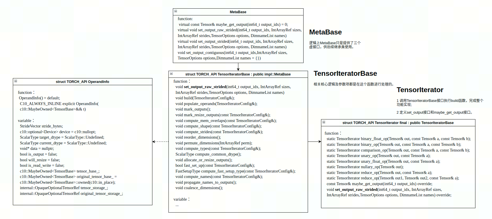
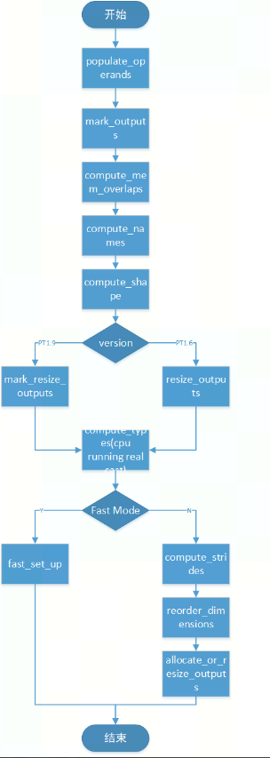

# TensorIterator
TensorIterator是一个基本的类实现，它是对各算子输入输出信息的一种抽象实现。其作用是遍历张量，在PyTorch代码库中，它被用于用于各种element-wise，reduce等算子。从字面意义上看，它更加侧重于是为张量做迭代运算的前处理操作，其通过抽取输入输出张量信息，计算出公共的shape，stride和dtype等，便于后续迭代计算使用。

```c++
void TensorIteratorBase::build_binary_float_op(
    const TensorBase& out, const TensorBase& a, const TensorBase& b) {
  build(TensorIteratorConfig()
        .set_check_mem_overlap(true)
        .allow_cpu_scalars(true)
        .promote_inputs_to_common_dtype(true)
        .cast_common_dtype_to_outputs(true)
        .enforce_safe_casting_to_output(true)
        .promote_integer_inputs_to_float(true)
        .add_owned_output(out)
        .add_owned_const_input(a)
        .add_owned_const_input(b));
}
```

## 总体代码实现
通过添加算子输入输出及各限制条件到TensorIteratorConfig类中，再通过调用build函数，构建TensorIterator对象，完成TensorIterator的构建和运算处理。

### TensorIterator基本代码结构
 - MetaBase类：TensorIteratorBase类的基类，主要定义基本虚函数set_output_xxx等接口实现;
 - TensorIteratorBase类：TensorIteratorBase类是TensorIterator的基类，其中包含operand列表等基本变量信息。同时也是整个TensorIterator的主体代码实现。
 - TensorIterator类：TensorIterator类主要定义各类构建函数，抽象了各类算子使用的配置信息。而后通过调用TensorIteratorBase类中的build函数，生成TensorIterator对象，完成TensorIterator的构建和运算处理。
 - TensorIteratorConfig类：TensorIteratorConfig类是TensorIterator的配置类，主要包含各种限制条件，如：是否为reduction、是否为inplace等。

 - TensorIterator相关类图：
   

### TensorIterator处理流程
TensorIterator构建过程分为以下几步：
 - build函数调用流程图：
   

 - 各函数功能说明：
   - populate_operands：根据config中的数据信息，读取输入输出tensor到TensorIteratorBase类的operand中，并设置num_outputs_;
   - mark_outputs：标记output operand的is_read_write标记位;
     判断output和self tensor是否为inplace场景，如果时则标记output operand的标记位is_read_write为True;
   - compute_mem_overlaps： 
     - 检查每一个output是否存在内存overlapping，如果存在则报错（仅可看作是expand模式，其他场景会走到TOO_HARD不判断）; 
     - 检查output和输入的input是否存在部分内存overlapping（partial_overlap）。
   - compute_names：NamedTensor相关names推导，相对使用较少，不做介绍;
   - compute_shape：基于输入和输出的operand信息（对Tensor信息的抽象类），通过函数infer_size_dimvector推断出common shape。
     - 如果output tensor可以被resize，或未定义，则不参与运算处理;
     - 维度计算common shape时，同时也会进行维度数值检查。如果维度数值不为1，且数值不想等，则报错;
     - 根据所有输入输出维度数值和维度大小，获取维度最大且数值最大的作为common shape。
   - mark_resize_outputs：标记output是否可以被resize处理。
     如果output operand的is_read_write标记位为True，且shape和common shape不一致时，标记output operand的will_resize标记位。 (先决条件： resize_outputs_只有unary和reduce设置为false，其他为true)
   - compute_types：基于输入operand信息（对Tensor信息的抽象类），通过函数compute_common_dtype推断出common type。
     - 当输入存在tensor且dtype存在差异时，会根据promote_inputs_to_common_dtype_标记位进行common type推断;
     - 根据标记位check_all_same_device_检查设备类型是否一致;
     - 当输出存在类型与common dtype不一致时，会根据enforce_safe_casting_to_output_标记位判断是否可以安全地进行类型转换;
     - 当common device为CPU设备时，当输入输出类型和common dtype不一致时，会创建一个临时tensor作为整个运算的output tensor，算子运算完后，则调用copy算子完成临时tensor到output tensor的拷贝动作。
       - 其中输出根据标记位：cast_common_dtype_to_outputs_，输入根据标记位：promote_inputs_to_common_dtype_;
       - 临时tensor和原tensor都会存储在operand中，其中临时tensor作为current，原tensor作为origin;
       - 设置operand的current dtype和target dtype为common dtype。
   - fast_set_up： 根据输入tensor的memory format信息，判断能否走fast路经，并进行output。
     - fast枚举值主要包含如下：CONTIGUOUS， CHANNELS_LAST， NON_OVERLAPPING_DENSE;
     - 如果所有定义的输入输出Tensor满足相同的size/stride pattern，则认为可以走fast路经，否则走stride路经。（其中output operand标记位will_resize为True，不参与运算判断。）
     - 如果满足fast路经，根据对应fast枚举值，创建或者resize output tensor为相同的shape和stride。
     - 如果满足fast路经，对所有的shape和stride进行维度折叠到维度1。
   - stride模式下相关函数处理：
     - compute_strides：
     - reorder_dimensions：根据stride计算permute的参数，调用permute_dimensions调整所有operands_的size和stride
     - allocate_or_resize_outputs：
     - coalesce_dimensions：

 - build函数相关调用：
```c++
void TensorIteratorBase::build(TensorIteratorConfig& config) {
  // populate some persistent configuration fields
  is_reduction_ = config.is_reduction_;
  enforce_linear_iteration_ = config.enforce_linear_iteration_;

  // fill in operands_ based on configuration
  populate_operands(config);
  // set is_output and is_read_write flags on appropriate tensors
  mark_outputs();
  // Check that the outputs have no internal overlap
  // and do not share memory with inputs.
  compute_mem_overlaps(config);
  // Check that input dimensions are aligned correctly & compute outnames.
  compute_names(config);
  // compute the broadcasted shape
  compute_shape(config);
  // mark outputs for resizing if necessary
  mark_resize_outputs(config);
  // compute the result dtype and device
  compute_types(config);
  // try fast setup output tensor, if failed, fallback to normal setup
  if (!fast_set_up(config)) {
    // compute each tensor's stride after broadcasting
    compute_strides(config);
    // re-order dimensions to improve coalescing
    reorder_dimensions();
    // allocate the output tensor if it's not provided
    allocate_or_resize_outputs();
    // coalesce adjacent dimensions when possible
    if (!is_meta_) coalesce_dimensions();
  }

  if (is_meta_) return;

  auto has_storage = true;
  for (auto& op : operands_) {
    has_storage &= op.tensor_base().has_storage();
  }
  auto privateuse1_without_storage =
     common_device_.type() == DeviceType::PrivateUse1 &&
     !has_storage;

  // XLA and lazy tensors don't have storage, so they don't have an underlying data pointer.
  // Nothing beyond this point is important for meta functions, so it's fine to exit early here.
  // Extend the condition to MAIA tesnors as MAIA tensors also don't have storage.
  if (privateuse1_without_storage  ||
      common_device_.type() == DeviceType::MTIA ||
      common_device_.type() == DeviceType::XLA  ||
      common_device_.type() == DeviceType::IPU  ||
      common_device_.type() == DeviceType::Lazy ||
      common_device_.type() == DeviceType::MAIA  ||
      common_device_.type() == DeviceType::HPU) return;

  for (auto& op : operands_) {
    TORCH_INTERNAL_ASSERT(op.tensor_base().defined());
    if (op.is_const) {
      // NOLINTNEXTLINE(cppcoreguidelines-pro-type-const-cast)
      op.data = const_cast<void*>(op.tensor_base().const_data_ptr());
    } else {
      op.data = op.tensor_base().mutable_data_ptr();
    }
  }

  // zero out offsets
  // If the tensor is a scalar, we leave room for it
  // So index translations in reduction can access
  // a valid value for the offset
  int64_t ndim_offsets = (ndim() ? ndim() : 1);
  view_offsets_ = DimVector(ndim_offsets, 0);
}
```


https://zhuanlan.zhihu.com/p/129778637
https://labs.quansight.org/blog/2020/04/pytorch-tensoriterator-internals