# Basic Concept
从0开始学习基本概念

## 基于Tuple构造的基本概念
基于Tuple类进行别名处理, 构建了基本存储容器Shape,Stride,Step,Coord,Tile。
注: 此处的Coord和cutlass中的Coord类存在差别, 待确认。
  ```c++
    template <class... Shapes>
    using Shape = cute::tuple<Shapes...>;

    template <class... Strides>
    using Stride = cute::tuple<Strides...>;

    template <class... Strides>
    using Step = cute::tuple<Strides...>;

    template <class... Coords>
    using Coord = cute::tuple<Coords...>;

    template <class... Layouts>
    using Tile = cute::tuple<Layouts...>;
   ```

## Stride
  - 代码路径: include/cute/stride.hpp
  - crd2idx函数, 通过Coord坐标信息, 计算对应Layout下真实的内存偏移量。
    - code:
      ```c++
        template <class Coord, class Shape, class Stride>
        CUTE_HOST_DEVICE constexpr
        auto
        crd2idx(Coord  const& coord,
                Shape  const& shape,
                Stride const& stride)
        {
          if constexpr (is_tuple<Coord>::value) {
            if constexpr (is_tuple<Shape>::value) {      // tuple tuple tuple
              static_assert(tuple_size<Coord>::value == tuple_size< Shape>::value, "Mismatched Ranks");
              static_assert(tuple_size<Coord>::value == tuple_size<Stride>::value, "Mismatched Ranks");
              // 展开计算每一个坐标点对应的offset, 然后进行累加。
              return detail::crd2idx_ttt(coord, shape, stride, tuple_seq<Coord>{});
            } else {                                     // tuple "int" "int"
              static_assert(sizeof(Coord) == 0, "Invalid parameters");
            }
          } else {
            if constexpr (is_tuple<Shape>::value) {      // "int" tuple tuple
              static_assert(tuple_size<Shape>::value == tuple_size<Stride>::value, "Mismatched Ranks");
              // 基于coord对shape进行求整数段和余数段, 余数段*对应维度stride；
              // 整数段和下一个shape进行余数段和整数段计算, 直到对应shape遍历完。
              return detail::crd2idx_itt(coord, shape, stride, tuple_seq<Shape>{});
            } else {                                     // "int" "int" "int"
              return coord * stride;
            }
          }

          CUTE_GCC_UNREACHABLE;
        }

        template <class CInt, class STuple, class DTuple, int I0, int... Is>
        CUTE_HOST_DEVICE constexpr
        auto
        crd2idx_itt(CInt   const& coord,
                    STuple const& shape,
                    DTuple const& stride, seq<I0,Is...>)
        {
          if constexpr (sizeof...(Is) == 0) {  // Avoid recursion and mod on single/last iter
            return crd2idx(coord, get<I0>(shape), get<I0>(stride));
          } else if constexpr (is_constant<0, CInt>::value) {
            return crd2idx(_0{}, get<I0>(shape), get<I0>(stride))
                + (_0{} + ... + crd2idx(_0{}, get<Is>(shape), get<Is>(stride)));
          } else {                             // General case
            auto [div, mod] = divmod(coord, product(get<I0>(shape)));
            return crd2idx(mod, get<I0>(shape), get<I0>(stride))
                + crd2idx_itt(div, shape, stride, seq<Is...>{});
          }

          CUTE_GCC_UNREACHABLE;
        }
      ```
  - compact函数, 基于Major方式计算对应的stride。
    - 主要分为两种方式, 即列主序LayoutLeft和行主序LayoutRight。两者调用函数基本一直, 只存在于最后构造Tuple的方式存在差异。列主序通过append进行顺序展开, 列主序则通过prepend进行从后进行展开。
    - 代码路径: include/cute/stride.hpp
      ```c++
        template <class Major, class Shape, class Current>
        CUTE_HOST_DEVICE constexpr
        auto
        compact(Shape   const& shape,
                Current const& current)
        {
          if constexpr (is_tuple<Shape>::value) { // Shape::tuple Current::int
            using Lambda = CompactLambda<Major>;                  // Append or Prepend
            using Seq    = typename Lambda::template seq<Shape>;  // Seq or RSeq
            return cute::detail::fold(shape, cute::make_tuple(cute::make_tuple(), current), Lambda{}, Seq{});
          } else {                                // Shape::int Current::int
            if constexpr (is_constant<1, Shape>::value) {
              return cute::make_tuple(Int<0>{}, current); // If current is dynamic, this could save a reg
            } else {
              return cute::make_tuple(current, current * shape);
            }
          }

          CUTE_GCC_UNREACHABLE;
        }
        // 其中CompactLambda的处理就是通过乘法逐步向后进行依次处理。
        template <>
        struct CompactLambda<LayoutLeft>
        {
          template <class Init, class Shape>
          CUTE_HOST_DEVICE constexpr auto
          operator()(Init const& init, Shape const& si) {
            auto result = detail::compact<LayoutLeft>(si, get<1>(init));
            return cute::make_tuple(append(get<0>(init), get<0>(result)), get<1>(result));  // Append
          }

          template <class Shape>
          using seq = tuple_seq<Shape>;                                                     // Seq
        };
      ```

## Layout
  - 代码路径: include/cute/layout.hpp
  - 大多数场景按照默认列模式的方式进行构造Layout。
    ```c++
      template <class Shape, class Stride = LayoutLeft::Apply<Shape> >
      struct Layout
         : private cute::tuple<Shape, Stride>   // EBO for static layouts
    ```
  - 相关函数介绍(待补充相关函数细节)
    - 计算layout总的维度形状或对应单个维度的形状:shape
    - 计算layout总的维度步长或对应单个维度的步长:stride
    - 计算layout总的元素个数或对应单个维度元素个数: size
    - 计算layout总的维度数或对应单个维度的维度数: rank
    - 计算layout总的嵌套深度或对应单个维度的嵌套深度: depth
    ** 待补充coshape和cosize的区别, 代码上是比较明确的, 但是理解上两个是一个东西。不知道哪里理解错误了。**
    - 计算layout或者对应维度的物理内存空间大小(将stride计算进去):coshape
      - code:
        ```c++
          template <int... Is, class Shape, class Stride>
          CUTE_HOST_DEVICE constexpr
          auto
          coshape(Layout<Shape,Stride> const& layout)
          {
            // Protect against negative strides
            auto abs_sub_layout = make_layout(shape<Is...>(layout),
                                              transform_leaf(stride<Is...>(layout), abs_fn{}));
            auto co_coord = as_arithmetic_tuple(abs_sub_layout(size(abs_sub_layout) - Int<1>{}));
            return co_coord + repeat_like(co_coord, Int<1>{});
          }
          // 主要通过operator()重载实现
          template <class Coord>
          CUTE_HOST_DEVICE constexpr
          auto
          operator()(Coord const& coord) const {
            if constexpr (has_underscore<Coord>::value) {
              return slice(coord, *this);
            } else {
              return crd2idx(coord, shape(), stride());
            }

            CUTE_GCC_UNREACHABLE;
          }

          // Convenience function for multi-dimensional coordinates
          template <class Coord0, class Coord1, class... Coords>
          CUTE_HOST_DEVICE constexpr
          auto
          operator()(Coord0 const& c0, Coord1 const& c1, Coords const&... cs) const {
            return operator()(make_coord(c0,c1,cs...));
          }
        ```
    - 计算layout或者对应维度的物理内存空间大小(将stride计算进去):cosize
      - code:
        ```c++
          template <int... Is, class Shape, class Stride>
          CUTE_HOST_DEVICE constexpr
          auto
          cosize(Layout<Shape,Stride> const& layout)
          {
            return size(coshape<Is...>(layout));
          }
        ```
    - 基于坐标点计算内存中的线性位置: crd2idx
      - 其核心逻辑是基于stride中的crd2idx_ttt函数实现, 基于shape和stride计算对应的物理内存的offset。
      - code:
        ```c++
          template <class Coord, class Shape, class Stride>
          CUTE_HOST_DEVICE constexpr
          auto
          crd2idx(Coord const& c, Layout<Shape,Stride> const& layout)
          {
            return crd2idx(c, layout.shape(), layout.stride());
          }
        ```
    - 基于Coord进layout切片:  slice
      - 相对与pytorch的slice, 其不支持跳步(step)的处理。
      - 如果对应切片维度为Underscore(也就是_, 对应Int<0> {}), 则表示该维度全部获取;
      - 如果对应切片维度为具体值, 则返回切片后的维度为空。
      - **对应维度通过Underscore获取后, sub-layout会保持对应shape和stride的维度数值大小。**
      - example:
        ```plain text
          auto layout = make_layout(make_shape (Int<5>{}, Int<2>{}, Int<3>{}),
                                    make_stride(Int<1>{}, 4, Int<3>{}));
          auto coord = cute::make_coord(_, 1, _);   // (_5,_3):(_1,_3)
        ```
      - code:
        ```c++
          template <class Coord, class Shape, class Stride>
          CUTE_HOST_DEVICE constexpr
          auto
          slice(Coord const& c, Layout<Shape,Stride> const& layout)
          {
          return make_layout(slice(c, layout.shape()),
                             slice(c, layout.stride()));
          }
          // underscore.hpp中实现: 
          template <class A, class B>
          CUTE_HOST_DEVICE constexpr
          auto
          slice(A const& a, B const& b)
          {
            if constexpr (is_tuple<A>::value) {
              static_assert(tuple_size<A>::value == tuple_size<B>::value, "Mismatched Ranks");
              return filter_tuple(a, b, [](auto const& x, auto const& y) { return detail::lift_slice(x,y); });
            } else if constexpr (is_underscore<A>::value) {
              return b;
            } else {
              return cute::tuple<>{};
            }

            CUTE_GCC_UNREACHABLE;
          }
        ```
    - 基于Coord进layout切片, 并计算偏移位置:  slice_and_offset
      - code:
        ```c++
          template <class Coord, class Shape, class Stride>
          CUTE_HOST_DEVICE constexpr
          auto
          slice_and_offset(Coord const& c, Layout<Shape,Stride> const& layout)
          {
            return cute::make_tuple(slice(c, layout), crd2idx(c, layout));
          }
        ```
    - 构造Layout函数: make_layout
      - 支持多种方式进行layout处理, 如果仅携带shape信息, 则默认按照列模式处理。
    - 按照给定序列顺序进行stride生产构造: make_ordered_layout(Shape const& shape, Order const& order)
      - example:
        ```Plain text
           make_ordered_layout(Shape<_2,_2,_2,_2>{}, Step<_0,_2,_3,_1>{})
           ->  (_2,_2,_2,_2):(_1,_4,_8,_2)
           make_ordered_layout(make_shape(2,3,4,5), make_step(Int<2>{}, 67, 42, Int<50>{}))
           -> (2,3,4,5):(_1,10,30,2)
           // shape index   shape value  new order   ref order      stride          produced stride
           //    0              2         Int<2>{}    Int<2>{}    {_1,_1, _1, _1}      _1
           //    1              3         Int<52>{}   Int<52>{}   {2,_1, _1, 5}        10
           //    2              4         Int<53>{}   Int<53>{}   {2, 3, _1, 5}        30
           //    3              5         Int<50>{}   Int<50>{}   {2, _1, _1, _1}       2
        ```
      - code:
        ```c++
          template <class Shape, class Order>
          CUTE_HOST_DEVICE constexpr
          auto
          make_ordered_layout(Shape const& shape, Order const& order)
          {
            return make_layout(shape, compact_order(shape, order));
          }
          // 调用compact_order, 核心处理逻辑。
          // 1)先平铺shape和order, 然后通过max_order获取最大静态order中的最大静态变量;
          // 2)基于最大常量生产一个新的max_seq, 和order保持相同rank;
          // 3)根据max_seq和order生成新的order, 将原有order中的非常量替换为对应位置的max_seq中的元素;
          // 4)compact_order计算获取最新的stride。
          template <class Shape, class Order>
          CUTE_HOST_DEVICE constexpr
          auto
          compact_order(Shape const& shape, Order const& order)
          {
            auto ref_shape = flatten_to_tuple(product_like(shape, order));

            auto flat_order = flatten_to_tuple(order);
            // Find the largest static element of order
            auto max_order = cute::fold(flat_order, Int<0>{}, [](auto v, auto order) {
              // 如果是C<a>和C<b>对比, 则返回C<a < b>, 此时如果a<b, 返回order, 反之则返回v;
              // 如果是v或order不为C<x>对象, 则返回v。
              if constexpr (is_constant<true, decltype(v < order)>::value) {
                return order;
              } else {
                return v;
              }

              CUTE_GCC_UNREACHABLE;
            });
            // Replace any dynamic elements within order with large-static elements
            auto max_seq = make_range<max_order+1, max_order+1+rank(flat_order)>{};
            // order为常量, 则返回order;
            // order为变量, 则返回seq_v;
            auto ref_order = cute::transform(max_seq, flat_order, [](auto seq_v, auto order) {
              if constexpr (is_static<decltype(order)>::value) {
                return order;
              } else {
                return seq_v;
              }

              CUTE_GCC_UNREACHABLE;
            });

            auto new_order = unflatten(ref_order, order);

            return detail::compact_order(shape, new_order, ref_shape, ref_order);
          }

        ```
    - 生成一个相同的Layout: make_layout_like
 
  - Layout代数运算中最核心的重点函数介绍
    主要包含Layout的composition操作, Layout的乘法和除法逻辑。
    官方介绍:  https://github.com/NVIDIA/cutlass/blob/main/media/docs/cute/02_layout_algebra.md
    从如下两行代码,可以粗略看出存在两个函数非常重要。
      ```c++
        logical_divide:  composition(layout, make_layout(tiler, complement(tiler, shape(layout))));
        logical_product:  make_layout(block, composition(complement(block, size(block)*cosize(tiler)), tiler));
      ```
    官方的说明如下:   We can think of composition as a layout B that is "selecting" certain coordinates from another layout A. But what about the coordinates that aren't "selected"? To implement generic tiling, we want to be able to select arbitrary elements -- the tile -- and to describe the layout of those tiles -- the leftovers, or the "rest."

    - coalesce:  维度折叠,存在如下三种场景。
      - 对于Layout操作时, 现将其flatten后, 再基于编译期常量进行列模式折叠操作。
        - 维度为Int<1>,忽略该维度;
        - size,stride满足get<I>(old_shape) * get<I>(old_stride) == get<0>(new_stride)折叠;
      - By-mode coalesce:  指定trg_profile, 对部分rank进行Layout模式折叠。
      - 对Shape进行折叠, 将左右分别是常量或者变量的进行折叠, 其余维度不变。
      - code:
        ```c++
          template <int I, class OldShape, class OldStride, class NewShape, class NewStride>
          CUTE_HOST_DEVICE constexpr
          auto
          bw_coalesce(OldShape const& old_shape, OldStride const& old_stride,
                      NewShape const& new_shape, NewStride const& new_stride)
          {
            if constexpr (I == -1) {
              // Base case, we're done
              if constexpr (is_constant<1, NewShape>::value) {
                return Layout<_1,_0>{};
              } else {
                return Layout<NewShape,NewStride>{new_shape,new_stride};
              }
            } else if constexpr (is_constant<1, decltype(get<I>(old_shape))>::value) {
              // shape<I>(layout) == _1, skip it and continue
              return bw_coalesce<I-1>(old_shape, old_stride, new_shape, new_stride);
            } else if constexpr (is_constant<1, NewShape>::value) {
              // Replace our shape-1 with anything (Can only happen on input new_shape/new_stride)
              return bw_coalesce<I-1>(old_shape, old_stride, get<I>(old_shape), get<I>(old_stride));
            } else if constexpr (is_static<decltype(get<0>(new_shape))>::value &&
                                is_constant<true, decltype(get<I>(old_shape) * get<I>(old_stride) == get<0>(new_stride))>::value) {
              // Merge modes because the shapes and strides match
              return bw_coalesce<I-1>(old_shape, old_stride,
                                      replace_front(new_shape,  get<I>(old_shape) * get<0>(new_shape)),
                                      replace_front(new_stride, get<I>(old_stride)));
            } else {
              // Can't replace or merge, so prepend a new mode
              return bw_coalesce<I-1>(old_shape, old_stride,
                                      prepend(new_shape,  get<I>(old_shape)),
                                      prepend(new_stride, get<I>(old_stride)));
            }

            CUTE_GCC_UNREACHABLE;
          }
        ```

    - complement: 基于A layout和某个物理空间大小M计算其补集,表示为B = complement(A, M)。
      - 在空间M上,A与B除0点外不存在交集;
      - B的stride是严格递增的;
      - B的大小是被M约束的,也就是size(B) >= M / size(A) 和 cosize(B) <= RoundUp(M / cosize(A)) * cosize(A)
      假设输入Layout A和一个正整数M, 构建一个新的layout。且满足如下公式: 
      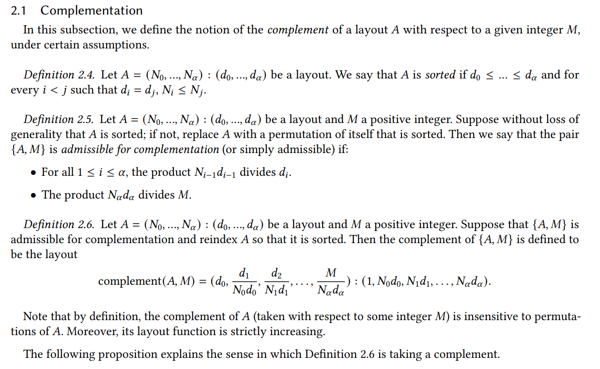
      - code:
        ```c++
          template <class Shape, class Stride, class CoTarget>
          CUTE_HOST_DEVICE constexpr
          auto
          complement(Shape const& shape, Stride const& stride, CoTarget const& cotarget)
          {
            std::cout << "complement input shape: " << shape
                      << " input stride: " << stride
                      << " cotarget: " << cotarget << std::endl;
            if constexpr (is_constant<0, Stride>::value) {
              // Special case for irreducible rank-1 stride-0 layout
              return make_layout(coalesce(cotarget));
            } else {
              // General case
              constexpr int R = rank_v<Shape>;
              static_assert(R == 1 || is_static<Stride>::value,
                            "Dynamic-stride complement only for rank-1 layouts");

              // Should just be a sort and a fold...
              // Then we could even handle dynamic strides (but they would destroy all static strides)
              auto [shape_, stride_, result_shape_, result_stride] =
                fold(make_seq<R-1>{},
                    cute::make_tuple(shape, stride, cute::make_tuple(), cute::make_tuple(Int<1>{})),
                    [](auto const& init, auto i)
                    {
                        auto [shape, stride, result_shape, result_stride] = init;
                        auto min_stride = cute::min(stride);
                        auto min_idx    = cute::find(stride, min_stride);
                        auto new_shape  = min_stride / get<i>(result_stride);
                        auto new_stride = min_stride * get<min_idx>(shape);
                        static_assert(not is_constant<0, decltype(new_shape)>::value, "Non-injective Layout detected in complement.");

                        return cute::make_tuple(remove<min_idx>(shape),              // Remove the min_idx from shape
                                                remove<min_idx>(stride),             // Remove the min_idx from stride
                                                append(result_shape , new_shape ),   // new shape  = min_stride / last_stride
                                                append(result_stride, new_stride));  // new stride = min_stride * curr_shape
                    });

              // Append the last shape mode
              std::cout << "after fold shape_: " << shape_ << " stride_: " << stride_ << std::endl;
              std::cout << "result_shape_: " << result_shape_ << " result_stride: " << result_stride << std::endl;
              auto new_shape    = get<0>(stride_) / get<R-1>(result_stride);         // new shape  = min_stride / last_stride
              static_assert(not is_constant<0, decltype(new_shape)>::value, "Non-injective Layout detected in complement.");
              auto result_shape = append(result_shape_, new_shape);
              std::cout << "result_shape_: " << result_shape << " result_stride: " << result_stride << std::endl;

              // Compute the rest_shape and rest_stride
              auto new_stride  = get<0>(stride_) * get<0>(shape_);                   // new stride = min_stride * curr_shape
              std::cout << "new_stride: " << new_stride << std::endl;
              auto rest_shape  = coalesce(ceil_div(cotarget, new_stride));
              auto rest_stride = compact_major<LayoutLeft>(rest_shape, new_stride);
              std::cout << "rest_shape: " << rest_shape << " rest_stride: " << rest_stride << std::endl;
              // Coalesce and append (rest_shape, rest_stride)
              return coalesce(make_layout(make_shape (result_shape , rest_shape ),
                                          make_stride(result_stride, rest_stride)));
            }

            CUTE_GCC_UNREACHABLE;
          }
        ```
      - example1:
        ```plain text
          auto layout = Layout<Shape<_2,_4,_8>, Stride<_8,_1,_64>>{};
          return test_complement(layout, cosize(layout));
          log info: 
          complement input shape: (_2,_4,_8) input stride: (_8,_1,_64) cotarget: _460
          after fold shape_: (_8) stride_: (_64)
          result_shape_: (_1,_2) result_stride: (_1,_4,_16)
          result_shape_: (_1,_2,_4) result_stride: (_1,_4,_16)
          new_stride: _512
          rest_shape: _1 rest_stride: _0
          complement((_2,_4,_8):(_8,_1,_64), _460)  =>  (_2,_4):(_4,_16)
          cosize(layout): _460
          cosize(result): _53
          // auto completed = make_layout(layout, result);
          cosize(completed): _512
          completed: ((_2,_4,_8),(_2,_4)):((_8,_1,_64),(_4,_16))
        ```
      - example2:
        ```plain text
          complement(4:1, 24) is 6:4. Note that (4,6):(1,4) has cosize 24. The layout 4:1 is effectively repeated 6 times with 6:4.
          complement(6:4, 24) is 4:1. Note that (6,4):(4,1) has cosize 24. The "hole" in 6:4 is filled with 4:1.
          complement((4,6):(1,4), 24) is 1:0. Nothing needs to be appended.
          complement(4:2, 24) is (2,3):(1,8). Note that (4,(2,3)):(2,(1,8)) has cosize 24. The "hole" in 4:2 is filled with 2:1 first, then everything is repeated 3 times with 3:8.
        ```

    - composition: 
      - layout是从index到value的线性映射(按照某个规则(layout), 将整数(index)映射成其他整数(value))。那么,我们可以基于某个已知的layout + 新规则,去构造一个新的layout。
      - 规定C = compose(A, B)是依据B的layout从A中取数, 得到的新layout为C。简单来说,是将B的layout作为index, 按照这个index从A中取数, 得到新的layout C。可以理解成gather过程, 即将这个多层级layout拉平。C(i) = A(B(i))
      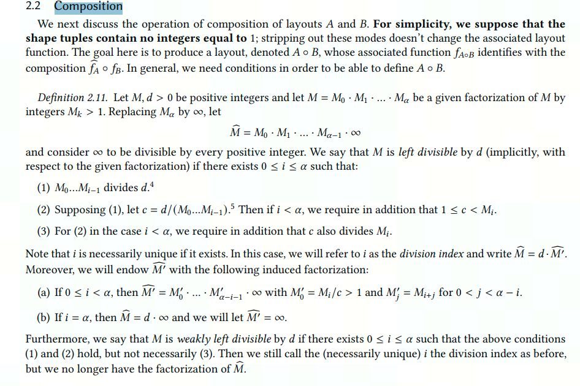

      - example1:
        ```plain text
          auto layoutA = make_layout(Shape<_4>{}, Stride<_2>{});
          auto layoutB = make_layout(Shape<_2>{}, Stride<_2>{});
          auto layoutR = composition(layoutA, layoutB);
          --> result: Layout: (_2,_1):(_4,_0)
        ```
        
      - example2:
        ```plain text
          auto layoutA = make_layout(Shape<_4,_3>{});
          auto layoutB = make_layout(Shape<_12>{});
          auto layoutR = composition(layoutA, layoutB);
          --> result: Layout: (_12,_1):(_1,_0)
        ```
        

  -  Layout代数运算中数据切片相关函数介绍
    - 从大内存块中切出小块，然后通过layout组合的方式呈现。其中小数据块具有相同的shape/stride，且stride大数据块的stride相同，只是通过不同的offset区分数据位置点。
      - 图示切片size/stride的映射关系;
        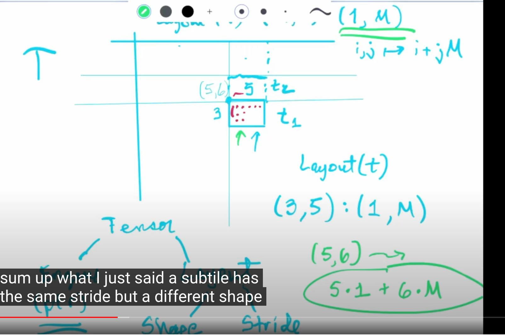
        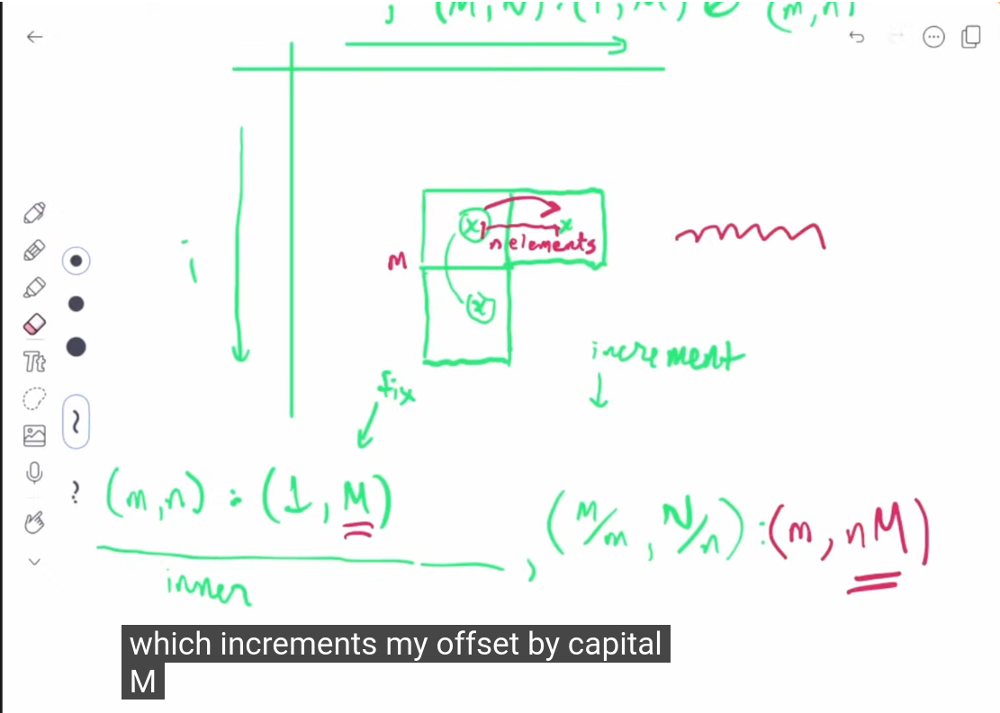
      - 基本公式
        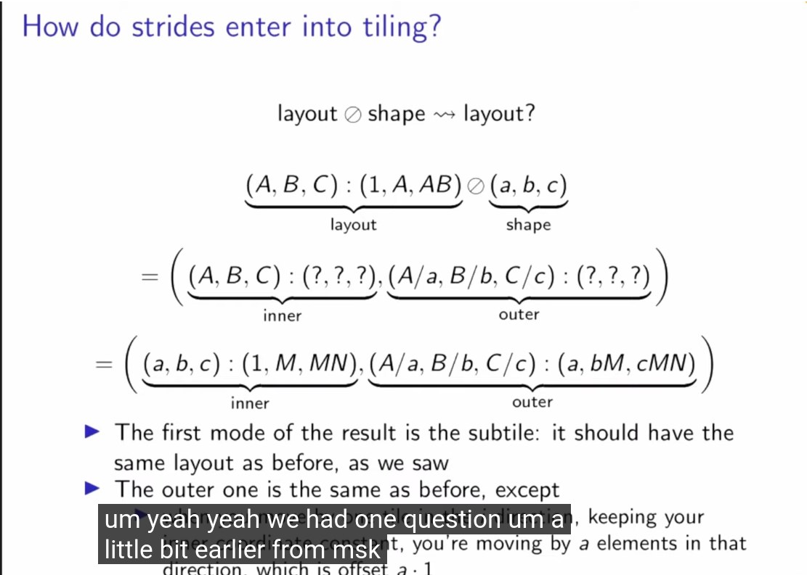
      - 其他
        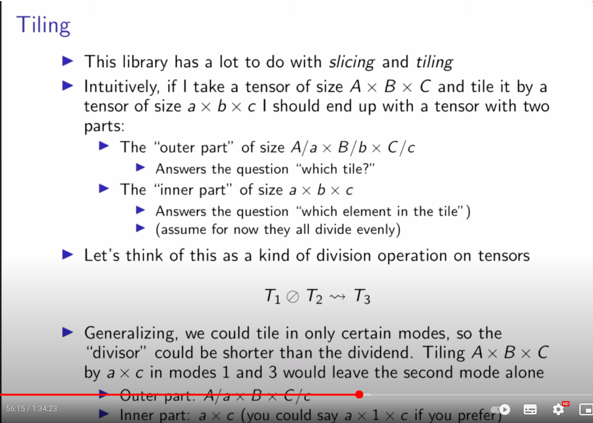
        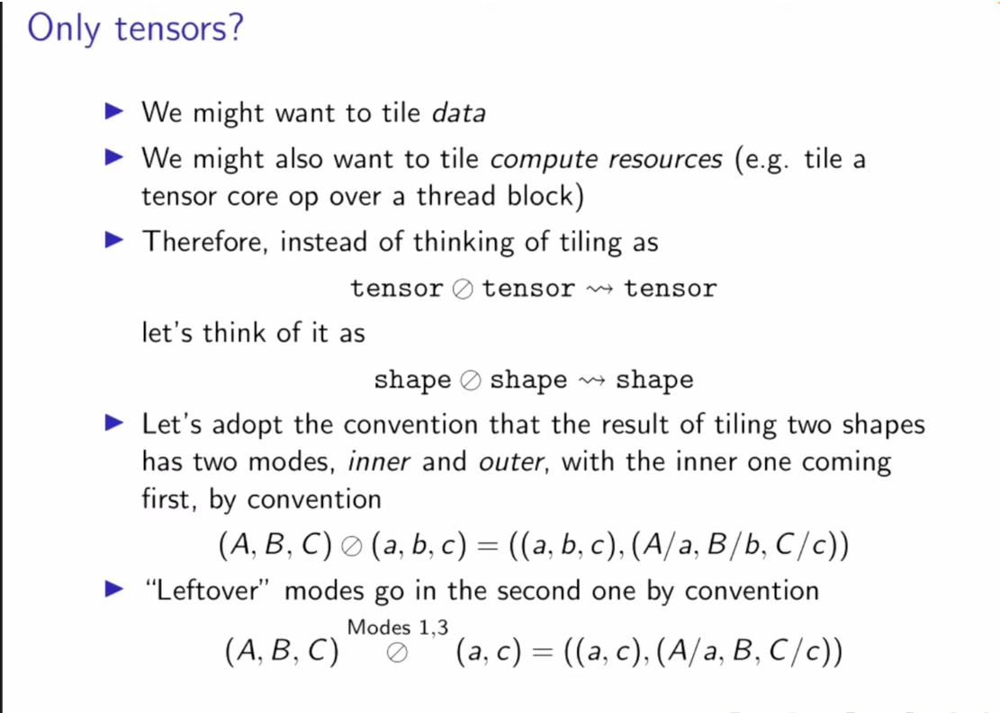

    - logical_divide: 从内存块中按照输入小块的维度进行切片,返回一个Layout,包含切块大小信息和对应每一小块的偏移量信息。
      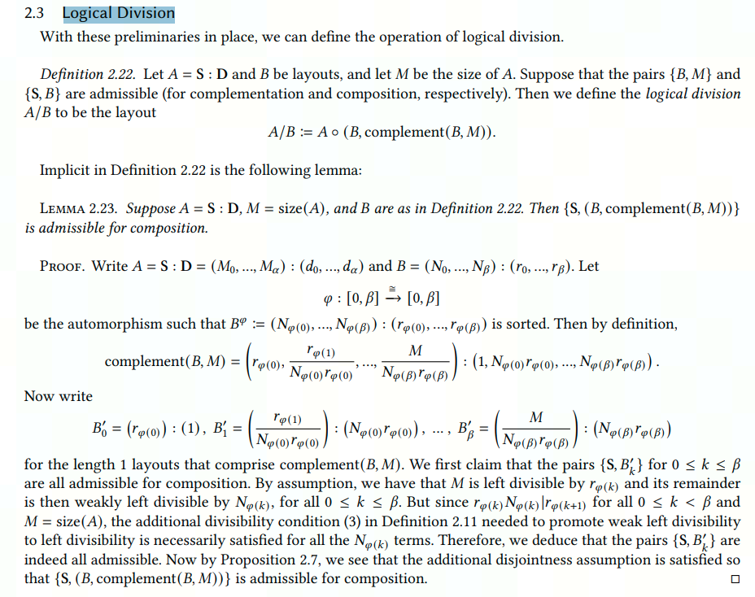
      - code:
        ```c++
        ```
      - example:
        ```plain text
          auto test_layout = make_layout(make_shape(256, 512));
          auto block_shape = make_shape(Int<128>{}, Int<64>{});
          auto result = logical_divide(test_layout, block_shape);
          --> result: ((_128,2),(_64,8)):((_1,_128),(256,16384))
        ```
    - tiled_divide: 从内存块中按照输入小块的维度进行切片,返回一个Layout,包含切块大小信息和对应每一小块的偏移量信息。
      - code:
        ```c++
        ```
      - example:
        ```plain text
          auto test_layout = make_layout(make_shape(256, 512));
          auto block_shape = make_shape(Int<128>{}, Int<64>{});
          auto result = tiled_divide(test_layout, block_shape);
          --> result: ((_128,_64),2,8):((_1,256),_128,16384)
        ```
      
    - make_fragment_like
    - inner_product
      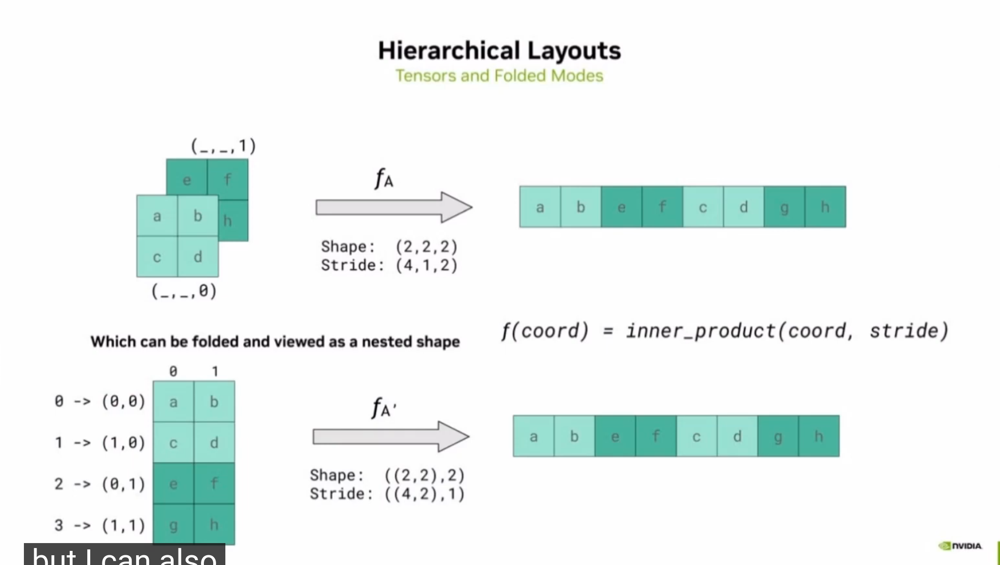

  -  Layout代数运算中数据乘积相关函数介绍
    - logical_product: 计算内存块和小块的乘积,返回一个Layout,包含切块大小信息和对应每一切块的偏移量信息。
      - code:
        ```c++
          template <class LShape, class LStride,
                    class TShape, class TStride>
          CUTE_HOST_DEVICE constexpr
          auto
          logical_product(Layout<LShape,LStride> const& block,
                          Layout<TShape,TStride> const& tiler)
          {
            return make_layout(block, composition(complement(block, size(block)*cosize(tiler)), tiler));
          }
        ```
      - example:
        ```plain text
          // Thread arrangement
          auto thr_layout = make_layout(make_shape(Int<32>{}, Int<8>{}));
          // Value arrangement per thread
          auto val_layout = make_layout(make_shape(Int<4>{}, Int<1>{}));
          auto layout_mn = logical_product(thr_layout, val_layout);
          --> result = ((_32,_8),(_4,_1)):((_1,_32),(_256,_0))
        ```

    - raked_product: 
      - code:
        ```c++
          template <class TShape, class TStride,
                    class UShape, class UStride>
          CUTE_HOST_DEVICE constexpr
          auto
          raked_product(Layout<TShape,TStride> const& block,
                        Layout<UShape,UStride> const& tiler)
          {
            constexpr int R = cute::max(rank_v<TShape>, rank_v<UShape>);

            auto result = logical_product(append<R>(block), append<R>(tiler));
            // std::cout << "raked_product: logical_product result = " << result << std::endl;

            return coalesce(zip(get<1>(result), get<0>(result)), tuple_repeat<R>(Int<1>{}));
          }
        ```
      - example:
        ```plain text
          // Thread arrangement
          auto thr_layout = make_layout(make_shape(Int<32>{}, Int<8>{}));
          // Value arrangement per thread
          auto val_layout = make_layout(make_shape(Int<4>{}, Int<1>{}));
          auto layout_mn = raked_product(thr_layout, val_layout);
          --> result: ((_4,_32),_8):((_256,_1),_32)
        ```
  
    - right_inverse: 将连续的layout按照stride连续的有小到大的序列,对shape进行重新排序,其中对应shape位置使用LayoutLeft生成的stride数值。如果无对应stride连续序列,则返回一个Layout<_1,_0>。
      - stride连续满足: using next_stride = decltype(get<next_I>(shape) * get<next_I>(stride));
      - code:
        ```c++
          template <class Shape, class Stride>
          CUTE_HOST_DEVICE constexpr
          auto
          right_inverse(Layout<Shape,Stride> const& layout)
          {
            auto flat_layout = coalesce(layout);
            auto astride = transform_leaf(flat_layout.stride(), abs_fn{});

            // Find Int<1>{}, the starting stride, and follow the strides to gen inverse_seq
            [[maybe_unused]] auto iseq = detail::inverse_seq<1>(flat_layout.shape(), astride, seq<>{});

            if constexpr (iseq.size() == 0) {
              return Layout<_1,_0>{};     // Empty case, nothing found
            } else {
              // Generate the corresponding new strides and construct
              auto rstride = compact_major<LayoutLeft>(flat_layout.shape());
              return make_layout(unwrap(transform(iseq, [&](auto i) { return shape<i>(flat_layout); })),
                                unwrap(transform(iseq, [&](auto i) { return signum(stride<i>(flat_layout)) * get<i>(rstride); })));
            }

            CUTE_GCC_UNREACHABLE;
          }
        ```
      - example:
        ```plain text
          auto layout = make_layout(make_shape(make_shape(Int<4>{}, Int<32>{}), Int<8>{}),
                                    make_stride(make_stride(Int<256>{}, Int<1>{}), Int<32>{}));
          auto result = right_inverse(layout);
          --> result: (_256,_4):(_4,_1)
        ```

## Hierarchy Layout
Hierarchy layout相对torch中的size/stride进行了延伸,其支持嵌套结构的封装。论文中的说明:We introduce a novel representation for tensor shapes, layouts and tiles. Graphene's tensors are decomposable into tiles represented as smaller nested tensors。表示方式为:((内部行数,外部行数1, 外部行数2,...),(内部列数,外部列数1,外部列数2,...))。
 - 例子1:Hierarchy layout -> Normal layout
   假设Hierarchy layout的shape为:((2,4), (3,5)),stride为:((1, 6), (2,24))。其表示内层数据块的shape为(2,3),且为行主序。外层数据块的shape为(4,5),且为列主序。
   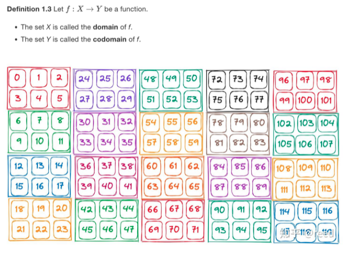
   转化为Normal Layout,其shape为:(4,5,2,3),stride为:(6,24,3,1)。
   对应取数坐标如下:
   auto row_coord = make_coord(1, 2);
   auto col_coord = make_coord(2, 1);
   auto coord = make_coord(row_coord, col_coord);
   则对应外层数据块坐标为(2,1),内层数据块坐标为(1,2),也就是数值为41的坐标。转换为普通坐标可以认为是(2, 1, 1, 2),根据公式:2 * 6 + 24 + 3 + 2 * 1 = 41。

 - 例子2:Normal layout -> Hierarchy layout
  假设torch的基本Tensor shape为(B,M,K),stride为(M * K,K,1),其表示为B个M*K大小的矩阵,其内部元素为K个连续的元素,外部元素为M*K个连续的元素。
  转化为Hierarchy layout的表示范围为:shape为(M, (K, B)),stride为(K,(1, M * K)),也就是内层数据块为shape(M, K),stride为(K, 1);外层数据块的shape为(1, B),stride为(1,M * K)。


相对比较详细的介绍:
https://www.youtube.com/watch?v=G6q719ck7ww

## Coord
Coord是表示一个坐标的模板类, 
  - 代码路经: include/cutlass/coord.h
  - 其主要存在三个模板参数:kRank, Index, LongIndex; 
  - 其内存通过数组进行坐标点存储, kRank表示坐标的维度, Index表示坐标的元素类型, LongIndex表示坐标点的偏移量。
  - Coord提供了一系列的数学计算, 方便进行坐标值的修改。


# 辅助工具及方法
## 单测试用例执行方法


probShape是实际输入的矩阵,tileShape是拆分维度信息,对gemm来说,tileShape这个是一个cluster处理的数据,刚好拆分给4个ipu。对unary来说,还要继续拆atomShape

template <class ElementwiseUnaryOperation,
          class ElementwiseUnaryLayout_ = Layout<Shape<_1, _1>>,
          class BlockTiler_     = Tile<Underscore, Underscore>,
          class AtomTiler_     = Tile<Underscore, Underscore>>
struct TiledElementwiseUnary : ElementwiseUnary_Traits<ElementwiseUnaryOperation> {}
参数说明:
ElementwiseUnaryOperation:操作函数,如log,exp,sigmoid等。
ElementwiseUnaryLayout_:表示block中各个Thread的排列方式,对应到MLU就是各个ipu的排列方式,默认为列主序;
BlockTiler_:表示总的处理数据量;
AtomTiler_:表示block中每个Thread处理的数据量,即AtomTiler按照ElementwiseUnaryLayout_排列,就是单次单个cluster处理的数据量。


TiledElementwiseUnary负责进行数据拆分,然后调用ElementwiseUnaryOperation进行计算。


2、Division
从上面的Composition可以看出，我们可以通过B，从原始A layout中做切出1个新的sublayout。

但这个sublayout只有1个，在应用场景下，通常是用户输入一个初始大Tensor，片上单次只能处理这个大Tensor的一部分（Tiler，在nl中我们一般称之为Block），算子需要计算这个大Tensor一共被拆成多少个Tiler块（在不同方向上一共需要做几次for循环）。

这类拆分操作，在cutlass被称为Division。

1）Logical Divide
设A =  (6, (4, 6)) : (2, (16, 70)), B = (2:3, (2, 3) : (1, 8))

C = logical_divide(A, B) = ((2, 3), ((2, 3), (2, 2))) : ((6, 2), ((16, 140), (32, 70)))

紫色部分是Tilter块（和B的shape相同）= (2, (2, 3))，橙色部分是tiler块在对应维度的重复次数（块的个数，cutlass中称之为rest），rest = (3, (2, 2))。

图示如下(相同颜色的部分表示同一个tiler块)：


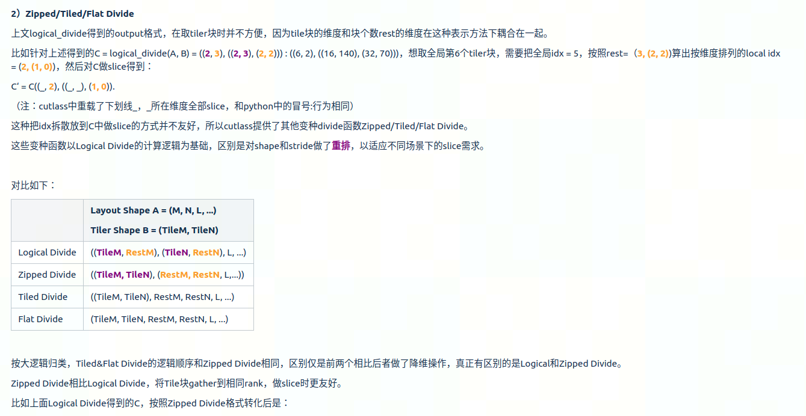

在cnnl场景下，用得比较多的也是Zipped Divide。实际应用场景下，算子不是对Layout，而是对Tensor做slice。

Tensor实际就是起始地址ptr + Layout的组合，cutlass除了支持Layout的divide之外，也支持Tensor的divide和slice操作。

cutlass在divide时将输入tensor做好拆分（size不变，维度变换），slice时将对应小块的首地址 + Layout分别计算出来后组合到一起，得到新的切片后的tensor。


比如nl中一个常见场景是输入tensor shape是(M, N)，片上findlimit得到单次最多计算(blkM, blkN)。

此时做完zipped divide得到output = ((blkM, blkN), M, N)，通过taskIdX和taskIdY对output做slice，拿到每个core上计算的blkTensor = output(_, _, (taskIdX, taskIdY))。


官方对于layout运算说明: https://research.colfax-intl.com/wp-content/uploads/2024/01/layout_algebra.pdf
论文链接: https://dl.acm.org/doi/pdf/10.1145/3582016.3582018
参考资料: https://zhuanlan.zhihu.com/p/661182311
参考资料: https://zhuanlan.zhihu.com/p/662089556
参考资料: https://www.youtube.com/watch?v=G6q719ck7ww
TMA资料: https://research.colfax-intl.com/tutorial-hopper-tma/
