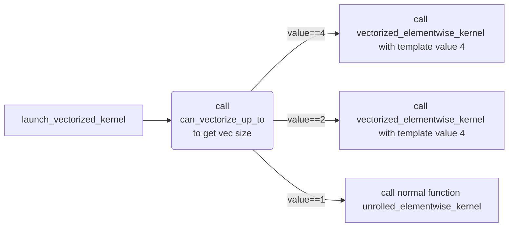

# gpu_kernel_impl
模板函数，入参为TensorIteratorBase对象和func_t对象, 其中算子的实现由func_t对象决定，而输入输出的数据由TensorIteratorBase对象决定。
```c++
template <typename func_t>
void gpu_kernel_impl(TensorIteratorBase& iter, const func_t& f) { xxx }
```

## 总体代码实现
从函数功能实现上来看，该函数通过传入的TensorIteratorBase对象和func对象，通过一套通用模板完成数据类型和连续性处理的抽象，从而便于统一进行处理。

### Kernel调用前代码实现
基于数据类型和数据连续性情况，构造policy对象，便于kernel统一化处理。

  - 通过func_t数据类型和TensorIteratorBase对象中真实数据类型对比，判断是否需要进行数据类型转换;
  - 通过TensorIteratorBase对象中真实数据连续性判断，判断是否进行向量化处理或离散数据读取处理。

### Kernel代码实现
基于policy对象和f函数，完成整体算子运算。

 - 从代码结构上看，总体处理可以简化为如下处理：
    ```c++
    template<typename func_t, typename policy_t>
    __global__ void func(func_t f, policy_t policy) {
      int idx = blockIdx.x;
      // malloc local mem for output and input
      return_t results[thread_work_size()];
      args_t args[thread_work_size()];
      // threadIdx is in load func
      policy::load(args, idx);
      for (int i = 0; i < thread_work_size(); ++i) {
        results[i] = f(args[i]);
      }
      // store result
      policy::store(result,idx);
    }
    ```

## Kernel调用前准备工作

### 判断是否进行数据类型转换
通过needs_dynamic_casting函数对比func_t函数签名中的数据类型和TensorIteratorBase对象中真实的数据类型，确认是否需要进行数据类型转换。
  ```c++
  // For input types check.
  template<typename func_t, int nargs=function_traits<func_t>::arity>
  struct needs_dynamic_casting {
    static bool check(TensorIteratorBase& iter) {
      using traits = function_traits<func_t>;
      using cpp_type = typename traits::template arg<nargs - 1>::type;
      using cpp_map = c10::CppTypeToScalarType<cpp_type>;

      if (iter.input_dtype(nargs-1) != cpp_map::value) {
        return true;
      }
      return needs_dynamic_casting<func_t, nargs - 1>::check(iter);
    }
  };
```

### 判断输入输出数据是否连续
这部分判断已经在TensorIteratorBase中完成，此处仅调用接口便可以完成。
  ```c++
  bool contiguous = iter.is_contiguous();
  ```

### 基于数据类型是否需要转换和输入输出是否连续进行策略选择和kernel选择
  - 4种策略说明：
    - 连续且无数据类型转换场景：调用向量kernel，当指针地址不满足对齐或者余数段处理时，也会调用非向量kernel;
    - 连续且需要数据类型转换场景：构造Load，Store时进行数据类型Cast处理，连续取数的policy;
    - 不连续且无数据类型转换场景：构造普通的Load，Store处理，不连续连续取数的policy;
    - 不连续且需要数据类型转换场景：获取真实数据类型list，构造不连续取数offset，调用kernel进行计算。

  - 限制说明：
    - 每个block中使用32 × 4个thread，每个thread处理4个数;
    - 每次最多处理65535个数，超出部分进行数据切片，多次调用gpu_kernel_impl处理。

#### 连续且无数据类型转换场景
基于TensorIteratorBase获取处理输入输出内存指针地址，元素个数和连续性状态。



  - can_vectorize_up_to： 通过递归的方式获取指针地址是否满足对齐要求；依次判断4 × sizeof(T)和 2 × sizeof(T)。
  https://developer.nvidia.com/blog/maximizing-unified-memory-performance-cuda/
  https://docs.nvidia.com/cuda/cuda-c-programming-guide/index.html#data-transfer-between-host-and-device
  When a warp executes an instruction that accesses global memory, it coalesces the memory accesses of the threads within the warp into one or more of these memory transactions depending on the size of the word accessed by each thread and the distribution of the memory addresses across the threads.
  Global memory resides in device memory and device memory is accessed via 32-, 64-, or 128-byte memory transactions. These memory transactions must be naturally aligned: Only the 32-, 64-, or 128-byte segments of device memory that are aligned to their size (i.e., whose first address is a multiple of their size) can be read or written by memory transactions.

  - vectorized_elementwise_kernel： 函数主要分为两部分处理，及余数段和整数段处理。(此处不进行余数段介绍，其处理思路和连续场景下vec size == 1的处理逻辑基本一致。)
    - memory::policies::vectorized<vec_size, array_t>， 构造策略policy对象。


#### 连续场景
基于launch_vectorized_kernel函数实现，默认按照每个thread处理4个数的向量大小逻辑编写。其中向量大小支持4个数，2个数和1个数的判断处理。


    - memory::policies： 数据load和store的策略处理。
      - memory::policies::LoadWithoutCast： 不进行数据类型转换。
      - memory::policies::LoadWithCast： 进行数据类型转换。其中数据类型转换主要借助于函数fetch_and_cast的实现完成，其可以简单理解为static_cast(对于bool，uint8等需要特别特化处理)。
      ```c++
      template <typename dest_t, typename src_t>
      struct static_cast_with_inter_type {
        C10_HOST_DEVICE __ubsan_ignore_undefined__ static inline dest_t apply(
            src_t src) {
          constexpr bool real = needs_real<dest_t, src_t>::value;
          auto r = maybe_real<real, src_t>::apply(src);
          return static_cast<dest_t>(r);
        }
      };
      ```
      - memory::policies::StoreWithoutCast: 本质逻辑同memory::policies::LoadWithoutCast。
      - memory::policies::StoreWithCast： 本函数逻辑同memory::policies::LoadWithCast。
   - 基于ThreadIndex的内存数据偏移计算
      - TrivialOffsetCalculator： 对于连续数据而言，其不存在stride进行处理，此处直接跟据线程索引计算出数据偏移。
      - 


#### 非连续场景


### 数据类型转换场景


